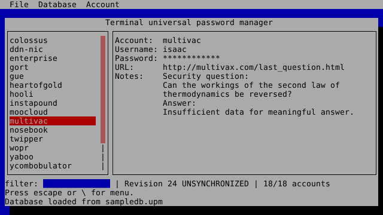

Terminal Universal Password Manager
========================================

The Terminal Universal Password Manager (`tupm`) is a terminal-based
interface to password manager databases produced by the
[Universal Password Manager (UPM)](http://upm.sourceforge.net/) project.
This is a proof-of-concept exercise, and should not be used in
production to protect real secrets.

Important disclaimers:

1. **This program may not be secure or reliable.**  It may corrupt your
   password database, expose your secrets, and keep your cereal from
   staying crunchy in milk.  You should absolutely read the "Risks"
   section, below, before even thinking about using it.  Consider
   yourself warned.
2. This code is an independent re-implementation of UPM, and is not
   related to the original UPM program or its author in any way other
   than its ability to read and write UPM databases and speak the
   HTTP-based UPM sync protocol.
3. This program was written as a learning exercise to gain experience
   with the process of developing Rust crates from "hello world" to
   "cargo publish".  The contained library providing access to UPM
   databases may be of some use for developers looking to import and
   export, but the program as a whole should be considered more of a
   proof-of-concept rather than production-ready software.

Tupm is dual-licensed under MIT or Apache 2.0, the same as Rust itself.

Screenshot
--------------------



Installation
--------------------

Tupm may be downloaded and installed via the Rust `cargo` command:

```
$ cargo install tupm
```

Usage
--------------------

```
Terminal Universal Password Manager 0.1.0
Provides a terminal interface to Universal Password Manager (UPM) databases.

USAGE:
    tupm [FLAGS] [OPTIONS]

FLAGS:
    -e, --export      Export database to a flat text file.
    -h, --help        Prints help information
    -p, --password    Prompt for a password.
    -V, --version     Prints version information

OPTIONS:
    -d, --database <FILE>    Specify the path to the database.
    -l, --download <URL>     Download a remote database.
```

Running `tupm` with no arguments will load the database present in
`$HOME/.tupm/primary` or create a new database if one does not already
exist.  A different database path may be specified with the `--database`
option.

Alternately, a database can be imported from an existing UPM sync
repository with the `--download` option.  (Only HTTP/HTTPS based
repositories are supported.  The option to use Dropbox is not
supported.)   The repository URL (without the database name appended)
should be provided.  By default, a database named "primary" is
downloaded and installed into `$HOME/.tupm/primary`, unless an alternate
database path was specified with `--database`.  You will be prompted for
the HTTP username and password credentials:

```
$ tupm --download https://example.edu/repo/
Downloading remote database "primary" from repository "https://example.edu/repo/".
Repository username: username
Repository password:
23708 bytes downloaded from repository.
Database written to: /home/username/.tupm/primary.
```

After a database is loaded, you are presented with a user interface
showing a navigable list of accounts, detailed information about the
selected account, a filter box (quickly accessible by pressing `/`), and
a menu of options accessible by pressing escape or `\`.  Most menu
options have keyboard shortcuts for direct invocation.

For the exceptionally brave among you, the `--export` command-line
argument will write a full plaintext report of the contents of the
database to standard output.  (It goes without saying that such exported
data is not at all protected by encryption and thus highly vulnerable.)

Risks
--------------------

I wrote Tupm as a Rust learning exercise.  I'm making it available on
the off chance that other developers might find its code useful when
interoperating with UPM databases.  However, for several reasons, I'd
like to discourage anyone from using it directly to manage passwords.

### Cryptography concerns with the UPM format

Work on UPM goes back to 2005, and its usage of cryptography would
probably be considered less than ideal by 2017 standards.  I'm not a
cryptographer, but I do have several concerns about the cryptography
used in the UPM format.

1. **Usage of PKCS#12 key derivation.**  UPM derives a key from the
   master password using the PKCS#12 v1.0 key derivation function (KDF).
   The latest PKCS#12 standard declares that this KDF "is not
   recommended and is deprecated for new usage" and recommends using
   PBKDF2 instead.  (See: [RFC 7292 Appendix B]
   (https://tools.ietf.org/html/rfc7292#appendix-B).) The PKCS#12
   KDF does not seem to be commonly used outside of protecting actual
   PKCS#12 data structures.  I'm not aware of any specific weaknesses
   that have been found, but its deprecation status doesn't inspire much
   confidence.
2. **Insufficient KDF iterations.** The effectiveness provided by a KDF
   such as the one specified by PKCS#12 is related to the number of
   iterations performed.  The original PKCS#12 v1.0 document from 1996
   used 1024 as an example iteration count, but this was later
   considered to be insufficient.  The count should be as high as
   possible to increase the cost of brute-force attacks without causing
   a noticeable delay for the user.  My underpowered Asus C201P
   ARM-based Chromebook can perform 1.5 million iterations/sec of
   PKCS#12 KDF, so iterations can be quite high.  The UPM format uses an
   iteration count of 20.
3. **Unauthenticated storage.**  The UPM cryptosystem does not provide
   any authenticity of the ciphertext, so an attacker could
   theoretically modify bits of the ciphertext to cause corruption,
   solicit unintended behavior from the parsing program, or possibly
   even yield different but seemingly valid decrypted plaintext.
   Any future revision of the format should calculate a MAC after
   encryption and include it in the database format, or ideally simply
   use an authenticated encryption mode such as GCM.

### In-memory handling of sensitive material

While Tupm is running, sensitive materials such as the master password,
derived keys, and the stored account passwords are stored in memory in
the clear, with little or no provision for erasing them when they are no
longer needed.  This is okay for a proof-of-concept demonstration, but
would definitely be **not good** for a production password manager.

Developing a set of best practices for handling such material in a
cross-platform application would be a great research project in and of
itself, and probably consider steps such as:
1. Zero-on-drop data structures that avoid the possibility of the compiler
   optimizing away the erasing.  Rust's lack of immovable types may also
   be an issue.
2. OS-specific features for each platform, such as `mlock()`/`munlock()`
   to prevent sensitive data from being swapped to disk, and
   `mprotect()` to prevent such data from being saved with core dumps.
3. Perhaps it will eventually be practical to make use of certain
   hardware-specific protection features where available, such as Intel
   Software Guard Extensions (SGX).

In addition to the memory of the Tupm program itself, sensitive
information could leak through adjacent programs.  For example,
passwords shown in the terminal may remain in the scrollback buffer, and
passwords copied to the system clipboard remain there until overwritten.

Thanks
--------------------

Thanks to Adrian Smith for developing the original UPM programs,
Alexandre Bury for the Cursive library used to provide the
terminal-based user interface, and the greater Rust community.
